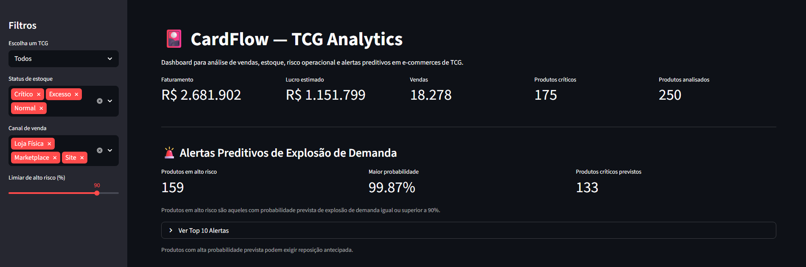
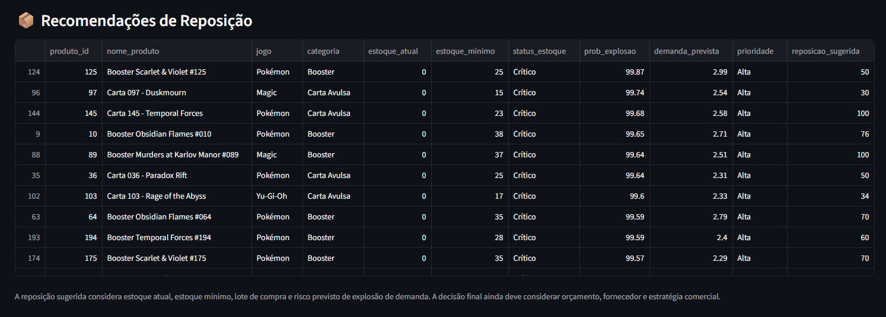
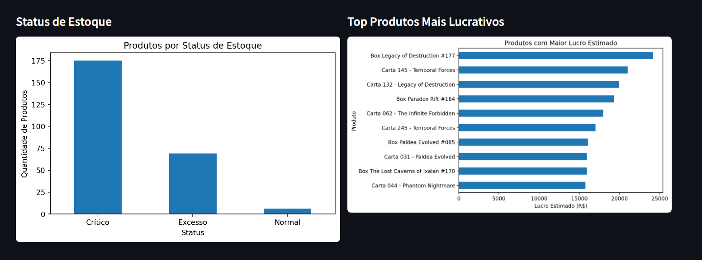

# CardFlow — TCG Analytics

## Dashboard

Acesse a aplicação:

https://cardflow-tcg-analytics.streamlit.app/

## Visão Geral

O **CardFlow** é um projeto de portfólio voltado à análise de vendas, gestão de estoque e detecção de risco operacional em pequenos e-commerces de **Trading Card Games (TCG)**.

O projeto simula uma operação de loja especializada em produtos de **Pokémon**, **Magic: The Gathering** e **Yu-Gi-Oh**, com o objetivo de apoiar decisões relacionadas a:

- risco de ruptura de estoque;
- excesso de estoque;
- comportamento de vendas;
- produtos mais lucrativos;
- explosões de demanda;
- recomendações de reposição.

A ideia nasceu a partir de uma situação real observada: um pequeno e-commerce de TCG enfrentou dificuldades para prever demanda e organizar estoque, o que prejudicou a continuidade da operação.

## Dashboard

Acesse a aplicação:

https://cardflow-tcg-analytics.streamlit.app/

---

## Preview

### Visão Geral



Dashboard executivo com KPIs, filtros e alertas preditivos.

---

### Recomendações de Reposição



Produtos classificados por prioridade com sugestões operacionais de reposição.

---

### Análises Operacionais



Visualizações para acompanhamento de estoque, lucratividade e comportamento comercial.

---

## Problema de Negócio

Pequenas lojas de TCG frequentemente precisam tomar decisões de compra e reposição com base em intuição ou histórico limitado.

Esse cenário pode gerar dois problemas principais:

1. **Ruptura de estoque**  
   Produtos com alta demanda acabam antes da reposição, causando perda de vendas.

2. **Excesso de estoque**  
   Produtos com baixa saída ficam parados, imobilizando capital.

No mercado de TCG, esse problema é ainda mais relevante porque a demanda pode variar rapidamente por causas como:

- lançamentos de novas coleções;
- mudanças no meta competitivo;
- promoções;
- sazonalidade;
- comportamento de colecionadores.

---

## Objetivo

Este projeto busca:

- identificar produtos em risco de ruptura;
- detectar excesso de estoque;
- analisar padrões de venda e lucratividade;
- simular problemas reais encontrados em bases de dados comerciais;
- construir uma base analítica para apoiar futuras previsões de demanda;
- avaliar modelos preditivos como suporte à tomada de decisão operacional;
- criar um dashboard interativo para monitoramento e recomendações.

---

## Dados Utilizados

Os dados foram gerados de forma sintética para simular uma operação real de e-commerce de TCG.

A base contém:

- 250 produtos;
- mais de 18 mil registros de vendas;
- informações de estoque;
- dados de três TCGs:
  - Pokémon;
  - Magic: The Gathering;
  - Yu-Gi-Oh.

Foram incluídas imperfeições propositais para tornar o projeto mais próximo de um ambiente real, como:

- valores ausentes;
- registros duplicados;
- categorias inconsistentes;
- outliers;
- datas em formatos diferentes.

Essas imperfeições foram tratadas durante o processo de análise e preparação dos dados.

---

## Estrutura do Projeto

```text
cardflow_tcg/
│
├── data/
│   ├── backup/
│   │   ├── estoque_tcg.csv
│   │   ├── produtos_tcg.csv
│   │   └── vendas_tcg.csv
│   │
│   ├── dashboard/
│   │   ├── app.py
│   │   ├── modelo_demanda.pkl
│   │   └── modelo_explosao.pkl
│   │
│   ├── notebooks/
│   │   └── cardflow_eda.ipynb
│   │
│   └── raw/
│       ├── estoque_tcg.csv
│       ├── produtos_tcg.csv
│       └── vendas_tcg.csv
│
├── scripts/
│   └── gerar_datasets.py
│
├── README.md
└── requirements.txt
````

---

## Tecnologias Utilizadas

* **Python** — linguagem principal do projeto;
* **Pandas** — manipulação, limpeza e tratamento dos dados;
* **NumPy** — geração e apoio em operações numéricas;
* **Matplotlib** — visualização gráfica;
* **Scikit-learn** — modelagem preditiva e pipelines de machine learning;
* **Joblib** — persistência dos modelos treinados;
* **Streamlit** — construção do dashboard interativo;
* **Jupyter Notebook** — documentação da análise e experimentação.

---

## Etapas Desenvolvidas

### 1. Geração dos Dados

Foi desenvolvido um script para gerar dados simulados de uma operação de e-commerce TCG.

O script cria:

* tabela de produtos;
* tabela de estoque;
* tabela de vendas.

Também foram adicionadas inconsistências propositalmente, permitindo demonstrar etapas reais de diagnóstico e limpeza de dados.

Arquivo:

```text
scripts/gerar_datasets.py
```

---

### 2. Análise Exploratória

O notebook realiza uma análise completa dos dados, incluindo:

* inspeção inicial;
* verificação de tipos;
* valores ausentes;
* duplicatas;
* padronização de categorias;
* conversão de datas;
* criação de métricas derivadas;
* análise de vendas;
* análise de estoque;
* análise de lucratividade;
* análise de produtos críticos.

Arquivo:

```text
data/notebooks/cardflow_eda.ipynb
```

---

### 3. Engenharia de Atributos

Foram criadas variáveis adicionais para enriquecer a análise e apoiar a modelagem:

* faturamento;
* lucro estimado;
* dia da semana;
* mês;
* risco de ruptura;
* variáveis de comportamento promocional;
* variáveis relacionadas a estoque.

---

### 4. Modelagem Preditiva

Foram desenvolvidas duas frentes de modelagem.

#### Previsão de demanda média

O objetivo foi prever a quantidade vendida.

Modelos testados:

* Regressão Linear;
* Random Forest Regressor;
* HistGradientBoostingRegressor.

Resultado geral:

* a Regressão Linear apresentou melhor desempenho para demanda média;
* o HistGradientBoosting teve desempenho próximo;
* a Random Forest apresentou resultado inferior.

A conclusão foi que os dados simulados possuem relações médias relativamente simples, mas com eventos extremos difíceis de prever por regressão tradicional.

---

#### Detecção de explosões de demanda

Como o mercado TCG possui picos abruptos de demanda, também foi criada uma abordagem de classificação.

O objetivo deixou de ser prever a quantidade exata vendida e passou a ser identificar se há risco de uma explosão de demanda.

Modelos testados:

* Logistic Regression;
* Random Forest Classifier;
* HistGradientBoostingClassifier.

A Regressão Logística foi escolhida como modelo principal para essa tarefa por apresentar maior recall na identificação de eventos extremos.

Esse critério foi priorizado porque, no contexto do CardFlow, deixar de identificar uma explosão de demanda pode gerar ruptura de estoque e perda de vendas.

---

## Dashboard Streamlit

O projeto inclui um dashboard interativo desenvolvido em Streamlit.

O dashboard apresenta:

* KPIs executivos;
* filtros por TCG, canal e status de estoque;
* alertas preditivos de explosão de demanda;
* recomendações de reposição;
* distribuição de produtos por TCG;
* faturamento diário;
* top produtos críticos;
* distribuição por canal de venda;
* status de estoque;
* top produtos mais lucrativos;
* amostra dos dados tratados.

Arquivo:

```text
data/dashboard/app.py
```

---

## Como Executar o Projeto

### 1. Clonar o repositório

```bash
git clone <url-do-repositorio>
cd cardflow_tcg
```

### 2. Criar ambiente virtual

```bash
python -m venv .venv
```

No Windows:

```bash
.venv\Scripts\activate
```

No Linux/Mac:

```bash
source .venv/bin/activate
```

### 3. Instalar dependências

```bash
pip install -r requirements.txt
```

### 4. Gerar os datasets

Caso deseje recriar os dados:

```bash
python scripts/gerar_datasets.py
```

Os arquivos serão gerados em:

```text
data/raw/
```

### 5. Executar o dashboard

```bash
streamlit run data/dashboard/app.py
```

---

## Principais Resultados

A análise mostrou que:

* o catálogo possui maior concentração de produtos Pokémon;
* boosters aparecem com alta frequência entre os produtos mais vendidos;
* há forte presença de produtos em status crítico;
* produtos mais vendidos nem sempre são os mais lucrativos;
* produtos premium, como boxes e cartas específicas, possuem alto impacto financeiro;
* eventos extremos são mais difíceis de prever por regressão tradicional;
* a classificação de explosões de demanda mostrou potencial para apoiar decisões preventivas.

---

## Valor Entregue pelo CardFlow

O CardFlow funciona como uma ferramenta de apoio à decisão para pequenos e-commerces de TCG.

Ele ajuda o lojista a responder perguntas como:

* quais produtos estão em risco de ruptura?
* quais produtos podem exigir reposição antecipada?
* quais itens possuem maior risco de explosão de demanda?
* quais produtos geram mais lucro?
* quais canais concentram maior volume de vendas?
* quais segmentos do catálogo exigem maior atenção?

Dessa forma, o projeto demonstra a aplicação prática de análise de dados e machine learning em um problema de negócio concreto.

---

## Limitações

Como os dados foram gerados de forma sintética, os resultados não representam uma loja real específica.

Além disso, o modelo de previsão de demanda apresenta limitações para eventos extremos, o que é esperado em mercados altamente dinâmicos como TCG.

Por esse motivo, o projeto utiliza uma camada complementar de classificação para identificar risco de explosão de demanda.

---

## Próximos Passos

Possíveis evoluções futuras:

- integração com APIs reais de marketplaces e catálogos TCG;
- previsão temporal por produto;
- inclusão de modelos específicos para séries temporais;
- monitoramento contínuo de estoque;
- alertas automáticos de reposição;
- otimização mais profunda de hiperparâmetros;
- inclusão de variáveis externas, como calendário de lançamentos e tendências competitivas;
- integração com banco de dados;
- containerização com Docker;
- pipeline automatizado para atualização de modelos.

---

## Status do Projeto

Projeto em versão MVP funcional e publicado.

Inclui:

* geração de dados;
* notebook analítico;
* modelos treinados;
* dashboard interativo;
* recomendações de reposição;
* alertas preditivos.
